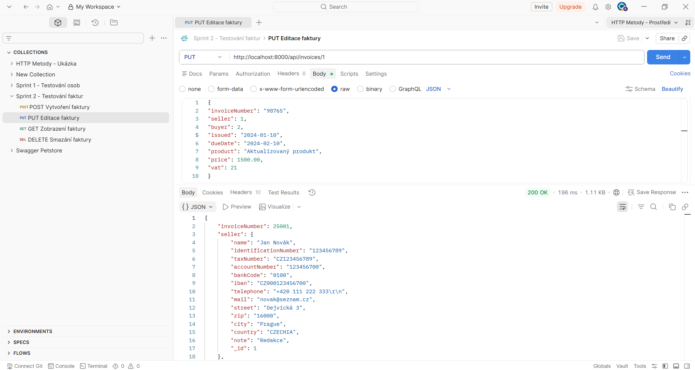
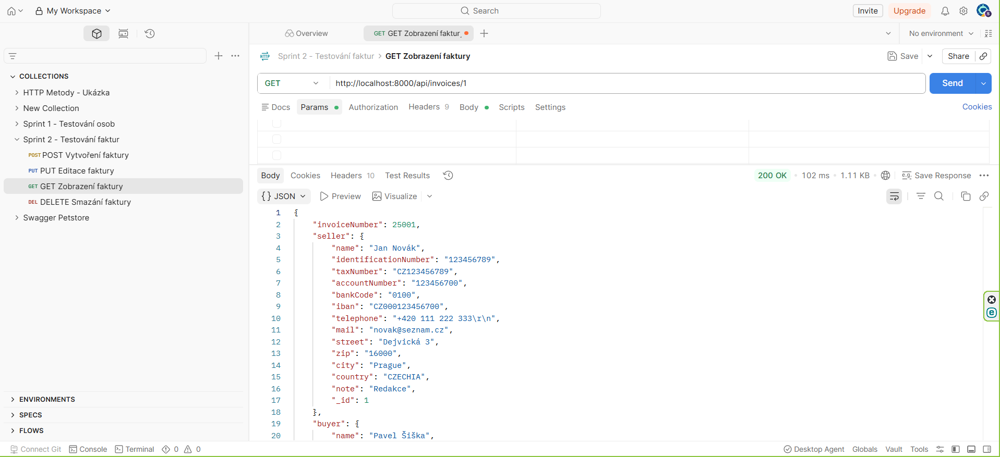

# Portfolio manuálního testování

Tento repozitář obsahuje ukázky **testovacích případů (Test Cases)** a **hlášení nalezených chyb (Bug Reports)**, které jsem vytvořila během manuálního testování webové aplikace pro správu osob a faktur.

Aplikace byla testována v lokálním vývojovém prostředí. Testovací případy i bug reporty byly během testování evidovány v nástroji **Jira**. Kromě testování uživatelského rozhraní (frontend) jsem ověřovala také funkčnost **REST API** pomocí nástroje **Postman**.

## Struktura repozitáře

```
.
├── README.md
├── test-cases
│   ├── persons
│   └── invoices
└── bug-reports
    ├── persons
    └── invoices
└── Screenshots
    ├── postman
    │   ├── TC003_GET_OvereniFaktury.png
    │   └── TC003_PUT_EditaceFaktury.png
```

## Přehled aplikace

Testovaná aplikace obsahuje dva hlavní moduly:

- **Osoby**
- **Faktury**

---

## Modul Osoby

Modul **Osoby** umožňuje:

- vytvářet nové osoby,
- zobrazovat detail osoby,
- upravovat údaje osob,
- mazat osoby,
- spravovat seznam osob.

---

## Modul Faktury

Modul **Faktury** umožňuje:

- vytvářet nové faktury,
- zobrazovat detail faktury,
- upravovat existující faktury,
- mazat faktury,
- filtrovat faktury podle zadaných kritérií,
- zobrazovat seznam faktur.

---

## Oblasti testování

Ukázky dokumentace zahrnují zejména:

- funkční testování,
- pozitivní i negativní testovací scénáře,
- validaci vstupních dat,
- CRUD operace,
- filtrování dat,
- navigaci v aplikaci,
- testování REST API pomocí Postmanu,
- evidenci nalezených chyb v Jira.

---

## Použité nástroje

- **Jira** – tvorba testovacích případů a evidence bug reportů
- **Postman** – testování REST API
- **Google Chrome** – testování webové aplikace
- **GitHub** – prezentace portfolia  

## Ukázky testování REST API

Součástí portfolia jsou také ukázky testování REST API vytvořené v nástroji **Postman**.

Testování zahrnovalo zejména:

- vytváření a organizaci Postman kolekcí,
- testování endpointů pomocí metod **GET**, **POST**, **PUT** a **DELETE**,
- ověřování HTTP stavových kódů,
- validaci odpovědí serveru,
- testování pozitivních i negativních scénářů.

### Editace faktury – metoda PUT



Ukázka testování API endpointu pro editaci faktury pomocí metody **PUT**.

### Ověření změny – metoda GET



Ověření provedené změny pomocí metody **GET**.

---

## Účel repozitáře

Cílem tohoto repozitáře je prezentovat ukázky mé práce v oblasti manuálního testování, tvorby QA dokumentace a testování webových aplikací.
